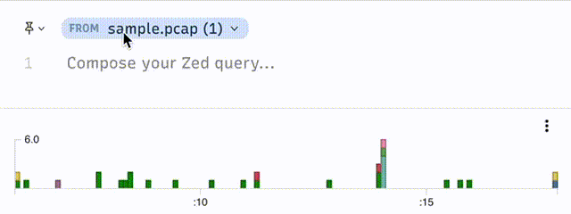
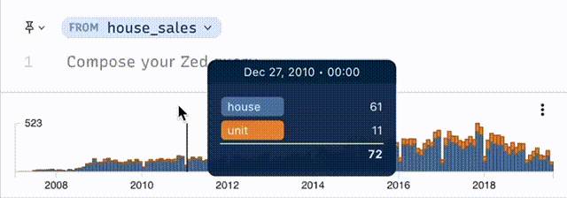

I'm working on a React app that has frequent data transitions. Each time a user submits a query, the state is reset as we wait for a response from the server. The new data can arrive quickly or slowly. If it arrives quickly, a flash of empty UI will render as the data is transitioning from the previous results to the current results.

## Before



Notice the flash of emptiness in the histogram.

Even though it's not that big of a deal, I want to avoid that. Let's write a short hook that will do this for us called _useDataTransition_.

At a high level, we need to prevent child React components from seeing the new data in their props until the transition is finished (we have all the new data) or a timeout expires (the new data is taking a while to arrive).

## Return Value

Let's work backward starting with the return value.  The hook should return the real data or a cache of the previous data. If we are "in transition" and the timeout has not expired, return the cached data, otherwise the real data.

```javascript
if (inTransition && !timeExpired) {
	return cache
} else {
	return real  
}

```

## Cache

Let's figure out when to cache. We must save the data before the transition starts. Let's put this in an effect that runs when _inTransition_ changes or when the data changes. Only cache if _isTransition_ is false. 

```javascript
const [cache, setCache] = useRef(data)

useEffect(() => {
 	if (!inTransition) cache.current = data
}, [inTransition, data])
```

This always caches the data while the we are not transitioning. Since we don't need to re-render when the cache changes, we can store it in a ref.

## Timer

Let's set that `timeExpired` variable. Whenever _isTransitioning_ changes to `true`, start a timer. When that timer finishes, update the `timeExpired` state. 

```js
const [timeExpired, setTimeExpired] = useState(false)

useEffect(() => {
  let id
  if (inTransition) {
    id = setTimeout(() => setTimeExpired(true), dur)
  } else {
    setTimeExpired(false)
  }
  return () => clearTimeout(id)
}, [inTransition])
```

We do want to re-render when `timeExpired` changes so we `useState`.

## The Finished Code

Now to bring it all together with TypeScript types.

```ts
export function useDataTransition<T>(
  real: T,
  inTransition: boolean,
  timeout: number
) {
  const [timeExpired, setTimeExpired] = useState(false)
  const cache = useRef(real)

  useEffect(() => {
    if (!inTransition) cache.current = real
  }, [inTransition, real])

  useEffect(() => {
    let id: number
    if (inTransition) {
      id = setTimeout(() => setTimeExpired(true), timeout)
    } else {
      setTimeExpired(false)
    }
    return () => clearTimeout(id)
  }, [inTransition])

  if (inTransition && !timeExpired) return cache.current
  else return real
}
```

We can use it like this:

```tsx
function HistogramContainer() {
  const isFetching = useSelector(getIsFetching)
  const noDataYet = useSelector(getIsEmpty)
  const realData = useSelector(getRealData)
  
  
  const data = useDataTransition(
  	realData,
  	isFetching && noDataYet,
  	300
	)
  
  return <Histogram data={data} />
}
```

In the example above, we consider the data transitioning if we are in the middle of fetching and if we have not yet received any results. If either of those change, the transition will be done and the real data displayed. If they remain true for longer than 300ms, the real data will again be displayed which probably means some loading UI. 

## After




## Post Script

At first, I put this logic in "thunks"; outside of React components. But because it was a UI issue, not part of business logic, it felt right to move it to the rendering layer.

Also, my first implementation wasn't working and I was struggling to figure out why. As a means to help me think clearly, I started writing this post and ended up with something that worked. Win, win!

I wrote this hook while working on the [Zui](https://github.com/brimdata/zui) app by [Brim Data](https://www.brimdata.io). Check us out if you ever need to work with heterogeneous datasets.
